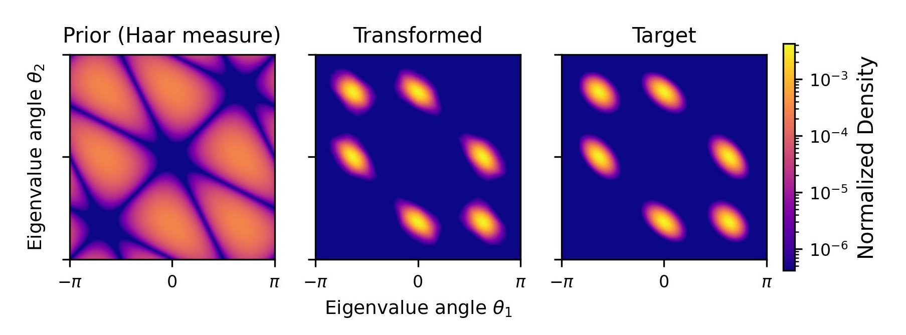

### Summary

Normalizing flows (NF) are a powerful class of generative models that allow for both
efficient sampling and exact likelihood evaluation [@rezende2015variational;
@papamakarios2021normalizing; @kobyzev2021normalizing].
Here we present `bijx`, a JAX library [@jax2018github] built on Flax NNX [@flax2020github] that combines a general normalizing flow API with specialized tools for physics, especially in the context of lattice quantum field theory.
The API mirrors standard patterns (e.g., `Bijection`, `Distribution`, `Chain`, `Transformed`) while making every component an `nnx.Module` for coherent parameter/state management and seamless use with modern JAX ML tools.
Beyond this general core, `bijx` provides first-class support for continuous normalizing flows (via `diffrax`), structure-preserving Crouch–Grossmann integrators for matrix Lie groups, symmetry-aware vector fields for lattice data, and utilities for Fourier and Lie algebra valued data.
The package is available via `pip`, with source code on GitHub (https://github.com/mathisgerdes/bijx).
Each capability can be used independently: the general NF API, continuous normalizing flow (CNF) interface, Lie-group integrators, and physics utilities are modular and separable.
General ML users can adopt the standard flow API and CNF interface without the physics utilities, and vice versa.

### Statement of need

The JAX ecosystem includes several flow libraries such as `distrax` [@deepmind2020jax] and `flowjax` [@flowjax], but these primarily target discrete flows on Euclidean spaces and general ML applications.
Many physics problems call for manifold-aware integration, continuous-time flows, and strict symmetry handling, which are not first-class in these packages.


`bijx` pursues an `nnx.Module`-centric design, a consistent runtime shape inference convention tailored to physics use-cases, and manifold-preserving ODE solvers as core abstractions.
Packaging the physics capabilities inside a general, familiar flow API lowers barriers for users: one can prototype with standard components and opt into the specialized tools when needed.
At the same time, the latter are also available independently and can be used in other contexts.

`bijx` consolidates, generalizes, and streamlines research code from prior work on equivariant models for lattice field theory and continuous flows for gauge theories [@gerdes2022learning; @gerdes2024equivariant].
While the package itself is newly organized, the specialized components reflect methods validated in these research contexts and are actively used in ongoing research in this domain.

Primary contributions beyond existing JAX libraries:

- **Continuous flows:** A unified interface for CNFs [@chen2018node] leveraging `diffrax` [@kidger2021on], inheriting flexible adjoints and solver choices from the latter.
- **Lie-group integration:** Structure-preserving Crouch–Grossmann integrators [@crouch1993numerical] for matrix Lie groups, differentiable via adjoint sensitivity.
- **Symmetry-aware vector fields:** Convolutional CNF architectures for lattice data, applicable to other grid-like domains.
- **Physics-domain tools:** Fourier degrees of freedom handling, matrix Lie group operations, and symmetry-aware data transforms.


### Design and Functionality

`bijx` favors composable primitives over monolithic training pipelines, as we anticipate its use in (physics) research contexts.
Users can assemble flows from small parts to match their problem, e.g. following one of the examples outlined in the documentation.

Core abstractions follow standard patterns: `Bijection` and `Distribution` compose via `Chain` and `Transformed`.
All components are `nnx.Module`s, giving consistent parameter/state handling, `jit`/`vmap` compatibility, and clean integration with modern tooling.
Runtime shape inference across batch/event/channel dimensions and an optional auto-vectorization utility enable flexible shape handling.

Time-dependent vector fields $f(t, x; \theta)$, typically represented by neural networks, can be turned into continuous flows via the CNF interface.
This leverages `diffrax`, exposing multiple integrators and adjoint methods.
For matrix Lie groups and Lie algebra–valued states, specialized Crouch–Grossmann integrators yield structure-preserving dynamics and remain fully differentiable.

The library includes building blocks such as a highly general `GeneralCouplingLayer` that reconstructs arbitrary bijection templates from parameters (automatic parameter extraction), supports indexing or multiplicative masks, and offers optional auto-vectorization. It also provides symmetry-aware convolutions for lattice data and utilities for vectorization and batching.
Extensive tests and tutorials support both standard and physics-focused workflows.

The library encourages extension by implementing minimal `Bijection` and `Distribution` interfaces, with a consistent runtime shape convention and `nnx.Module` state handling.
Performance-critical paths are JIT-compiled and `vmap`-friendly, minimizing Python overhead.
A continuous integration pipeline runs unit tests and doctests across configurations, and versioned documentation provides API reference and tutorials.

An optional `bijx.flowjax` module provides a lightweight adapter that enables bidirectional reuse of bijections and distributions between `bijx` and FlowJAX.
This exemplifies how `bijx` complements, rather than replaces, existing tools, and how similar patterns can be implemented for other flow libraries.

### Illustrative Example

The documentation (https://mathisgerdes.github.io/bijx/) includes basic 2D and higher-dimensional examples using the general API.
Following a very basic linear flow to showcase the API, here we highlight a physics use-case from the tutorials to illustrate the specialized capabilities.

A typical workflow composes bijections and wraps a base distribution.

```python
import jax, jax.numpy as jnp
import bijx

prior = bijx.IndependentNormal(event_shape=(2,))
flow = bijx.Chain(
    bijx.Shift(jnp.array([1.0, -1.0])),
    bijx.Scaling(jnp.array([0.5, 2.0])),
)
dist = bijx.Transformed(prior, flow)
y, logp = dist.sample(batch_shape=(1024,), rng=jax.random.key(0))
```

Moving on to a physics use-case, we train a continuous flow on the SU(3) Lie group to learn a Wilson-like target density,
$$p(U) \propto \exp\left(-\beta \sum_{i=1}^3 c_i \operatorname{Re}[\operatorname{tr}(U^i)]\right).$$
Here we choose $c_1 = 0.17$, $c_2 = -0.65$, and $c_3 = 1.22$.
Conjugation-invariance is enforced by building the vector field as the gradient of a "potential" defined in terms of invariant features, and dynamics are integrated with the Crouch–Grossmann solver to remain on the manifold.
Starting from the Haar measure, the model is optimized to match the target by minimizing the reverse Kullback-Leibler divergence.
As shown in \autoref{fig:su3}, the resulting density captures the target's shape and symmetries.

{#fig:su3}

### Acknowledgements

We thank collaborators who used this software and provided early feedback on the design of various components of this library.

### References
